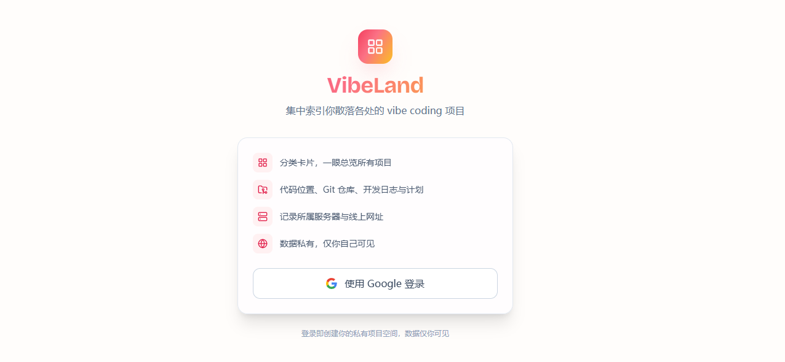

# VibeLand

> 在 vibe-coding 浪潮里，把你散落各处的项目重新收拢到一处。

[English](./README.en.md) · 🔗 [vibe-land.c01dkit.com](https://vibe-land.c01dkit.com)

## 这是什么

VibeLand 是一个**个人项目索引门户**。

当你用 vibe coding 的方式快速起项目，代码会散落在不同的电脑、服务器和目录里：这台机器上一个小工具、那台 VPS 上一个网站、某个仓库里一个半成品……时间一长，你自己都未必记得清「那个项目的代码在哪、仓库地址是什么、到底上线了没」。

VibeLand 把它们**集中索引**起来——一个只属于你的私人空间，一眼看全手头所有项目。

## 能帮你记录

- 按**分类**陈列的项目卡片，整体一目了然
- 每个项目的**代码位置、Git 仓库、所属服务器、线上网址**
- **介绍 / 开发日志 / 计划**（用 Markdown 书写）
- **截图**、标签、状态（开发中 / 已上线 / 已归档）与置顶

## 私有且安全

用 Google 账号登录，**数据仅你本人可见**，不同账号之间互不可见。
